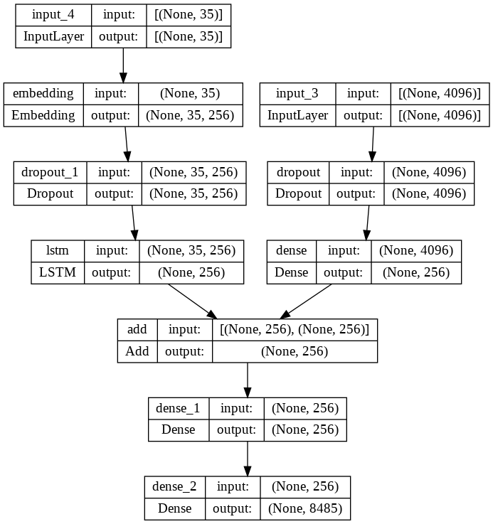

# Image_caption_generator
## A streamlit-based web app which will generate caption for the input image

- In this app, the user has to give an image as an input
- Then trained model will generate caption for the image
- It will display the relevant caption for the image

# [Judge our work here.](https://jahnavibattu02-image-caption-generator-icg-streamlit-yr65rg.streamlitapp.com/)
